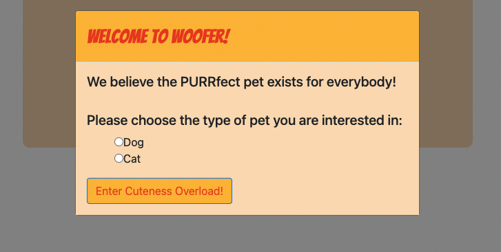

# Woofer
<!--quick description of application-->
Ready to find your fur-ever? Woofer is an image sharing platform designed to enable passionate pet lovers to discover pets of their interest. 
The process is simple, just like Tinder: to show your love, click on the check mark; not love at first sight? Click on the cross mark.
Adding a furry member to your family will change how you spend your time, your money, and you may even need to make changes to how your home is set 
up to accommodate your pet. So, if you’ve already evaluated your decision carefully and are ready to adopt a pet, the next step is deciding what type of pet is best for you and your family. 

## Getting Started
<!--link repo and deployed application-->

Please click on the links below to go to the repository:
* [GitHub Repository](https://github.com/juniordentax100/Project1)

Please click on this link below to go to the deployed application:
* [Deployed Application](https://juniordentax100.github.io/Project1/)

### Prerequisites <!--optional-->

A web browser and internet connection. 
 
### Summary
* The use of advanced HTML, CSS and Javascript concepts to create a fully function application from scratch.
* This project emphasizes the use of all technologies learned while applying said technologies within a group git workflow dynamic.

### Technologies Used:<!--optional-->
* HTML5
* CSS
    * Bootstrap
* Javascript
    * JQeury.js

## Authors

* **Jakub Matyskiewicz** - [Git Hub Profile](https://github.com/juniordentax100)
* **Kritika Pokhrel** - [Git Hub Profile](https://github.com/kassiakat)
* **Leanne Rajan** - [Git Hub Profile](https://github.com/Leanne-027)
* **Veng Lee** - [Git Hub Profile](https://github.com/vengster)

## Acknowledgments

* [google](https://wwww.google.com)